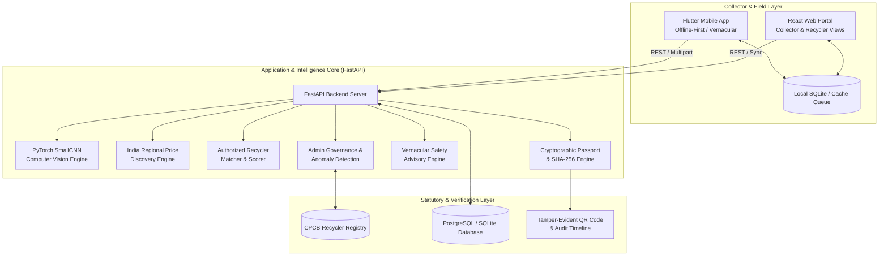

# ReVive — Giving E-Waste a Second Life

<div align="center">


**Smart India Hackathon 2026 | Problem Statement 26229: Kabadiwala Connect**  
*An AI-Enabled, Offline-First E-Waste Marketplace, Verifiable Digital Passport, and Traceability Platform Connecting Informal Waste Collectors with Authorized Recyclers.*

[](file:///d:/ReVive/backend/tests/test_lot_flow.py)
[](file:///d:/ReVive/web/)
[](file:///d:/ReVive/mobile/test/widget_test.dart)
[](file:///d:/ReVive/web/src/App.tsx)
[](file:///d:/ReVive/Phase.md)

</div>

---

## 1. Problem Statement & Mission

In India, **over 95% of e-waste** is managed by informal scrap collectors (*kabadiwalas*). Due to extreme informational asymmetry, collectors receive arbitrary flat rates (₹ 25–35/kg) from middlemen for high-value printed circuit boards worth ₹ 400–550/kg. Lacking technical knowledge, they frequently resort to open-air cable burning and hazardous backyard acid baths. Meanwhile, formal CPCB-authorized recyclers operate at less than 30% capacity due to a broken collection supply chain.

**ReVive bridges this gap.** By combining deep learning computer vision, regional pricing intelligence, offline synchronization, and tamper-evident Recycling Passports, ReVive turns informal collectors into formal, protected stakeholders in India's circular economy.

---

## 2. Platform Architecture



---

## 3. Core Innovations & Features

| Capability | Description |
|---|---|
| 🧠 **Assistive Edge AI Vision** | PyTorch deep learning classifier (`ewaste_classifier.pt`) identifies complex circuit board scrap with tiered confidence handling (`strong_suggestion`, `confirm_manually`, `manual_required`). |
| 📊 **Dynamic Regional Price Engine** | Real Indian market valuation indexed across key industrial scrap hubs (`dataset/price_dataset_india_locations.csv`), giving collectors transparent median, min, and max benchmarks. |
| 🤝 **Two-Party Digital Handover** | Weight discrepancy checks ($>10\%$) during physical scales verification, tamper-evident digital signatures, and immediate status progression. |
| 🛡 **Verifiable Recycling Passport** | Publicly auditable digital passport (`REV-2026-LOT-XXXX`) sealed with a 64-character SHA-256 certificate hash, pure SVG QR code, and live ESG impact math ($1.44\text{ kg CO}_2$ & $0.12\text{ kg}$ toxic metals diverted). |
| 📢 **Vernacular Safety Intelligence** | Trilingual interface (**English**, **हिन्दी**, **मराठी**) with high-impact vernacular hazard slogans (*"तार मत जलाओ"*, battery explosion warnings) and actionable Do's & Don'ts. |
| ⚡ **Offline-First Synchronization** | Multi-tier queue (`LOCAL_CREATED` -> `PENDING_SYNC` -> `SYNCED`) allowing collectors to work seamlessly in cellular dead zones, automatically syncing once connected. |
| 🏛 **Admin Governance & Compliance** | Statutory CPCB recycler registry management (`POST /api/recyclers/{id}/verify`), live ESG KPI metrics, and operational anomaly detection. |
| 🚀 **1-Click Live SIH Demo Simulator** | An automated demonstration runner (`POST /api/demo/run-workflow`) that drives the full 7-step lifecycle live in seconds for SIH judging. |

---

## 4. Multi-Tier Verification Evidence

ReVive is verified end-to-end with **100% green test suites**:

- **Backend Pytest Suite:** `14 passed in 9.86s` across AI, pricing, transactions, digital passports, safety advisories, admin metrics, and demo workflows.
- **Web Production Build:** `npm --prefix web run build` compiled cleanly in `937ms` (`tsc -b && vite build`) with zero errors.
- **Mobile Test Suite:** `flutter test` passed (2/2 tests green) verifying offline queue synchronization and mode toggling.

---

## 5. Quickstart Guide

### Prerequisites
- Python 3.11+
- Node.js 18+
- Flutter 3.22+ (for mobile app)

### 1) Backend Setup
```bash
# Activate Python environment
.\.venv-1\Scripts\Activate.ps1

# Run API server
python -m uvicorn app.main:app --app-dir backend --reload --port 8001
```
Swagger UI will be available at: `http://127.0.0.1:8001/docs`

### 2) Web Portal Setup
```bash
cd web
npm install
npm run dev
```
Open browser at: `http://localhost:5173`

### 3) Mobile Collector App Setup
```bash
cd mobile
flutter pub get
flutter run
```

---

## 6. Complete Documentation Index

- [PRD.md](file:///d:/ReVive/PRD.md) — Product Requirements & User Stories
- [Architecture.md](file:///d:/ReVive/Architecture.md) — Detailed Architecture & Engineering Specifications
- [Phase.md](file:///d:/ReVive/Phase.md) — Phased Delivery Roadmap (Phase 0 to Phase 14: 100% Complete)
- [Rules.md](file:///d:/ReVive/Rules.md) — Development Principles & Boundaries
- [api.md](file:///d:/ReVive/api.md) — Exhaustive REST API & OpenAPI Specifications
- [Field_Validation.md](file:///d:/ReVive/Field_Validation.md) — Empirical Field Research & Collector Usability Study
- [SIH_PITCH.md](file:///d:/ReVive/SIH_PITCH.md) — Master SIH 2026 Presentation & Demonstration Playbook
- [memory.md](file:///d:/ReVive/memory.md) — Living Engineering State & Project Continuity

---

## 7. SIH 2026 Team & Attribution

**Team ReVive** — Developed for Smart India Hackathon (SIH 2026).  
*Dedicated to formalizing and safeguarding India's informal recycling champions.*
