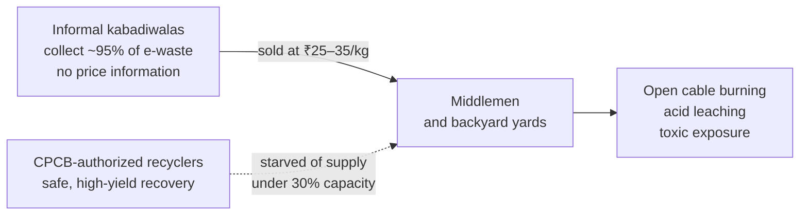
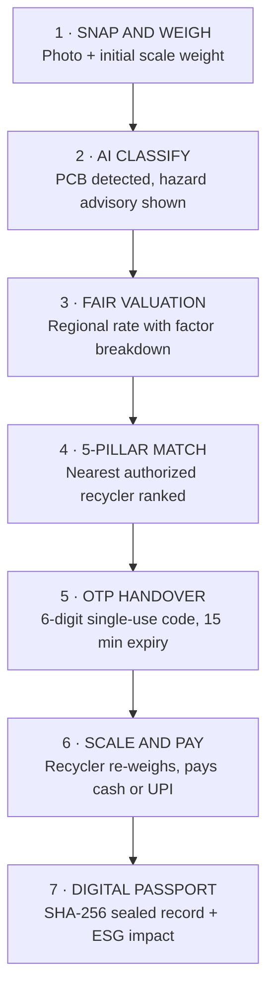
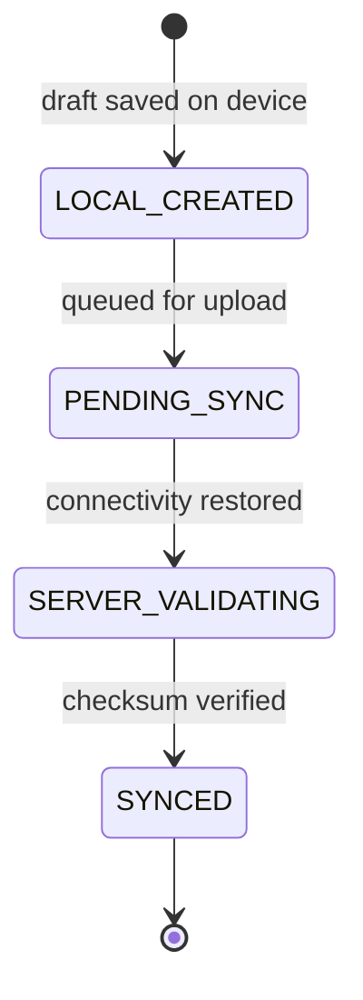

<div align="center">


# ReVive — Giving E-Waste a Second Life

**Bringing India's informal waste collectors into the formal, safe, and profitable circular economy**

Smart India Hackathon 2026 · Problem Statement **SIH26229 — Kabadiwala Connect**

[-brightgreen.svg?style=for-the-badge&logo=pytest)](backend/tests)
[-blue.svg?style=for-the-badge&logo=vite)](web/)
[](mobile/test/)
[](web/src/App.tsx)
[](docs/SIH26229_COMPLIANCE.md)
[](LICENSE)

[**Quickstart**](#11-quickstart) · [**Judge Demo**](#9-one-click-demo-for-judges) · [**Architecture**](#6-system-architecture) · [**Demo Guide**](docs/SIH_DEMO.md) · [**Compliance Matrix**](docs/SIH26229_COMPLIANCE.md) · [**API Docs (local)**](http://127.0.0.1:8001/docs)

</div>

---

## At a Glance

| | |
|:---|:---|
| **The gap we close** | Collectors are paid ₹25–35/kg for circuit boards worth ₹400–550/kg in recoverable material |
| **Who it serves** | Informal collectors (mobile), authorized recyclers (web), CPCB / EPR regulators (web) |
| **How it works** | Snap → AI classify → fair price → recycler match → OTP handover → cash/UPI → tamper-evident passport |
| **Built for the field** | Voice guidance in Hindi, Marathi, English · fully offline intake · cash-first accounting |
| **Verified** | 55 backend tests + 13 mobile tests passing · web build with 0 TypeScript errors |
| **See it live** | One API call runs the entire lifecycle in under 2 seconds ([jump to demo](#9-one-click-demo-for-judges)) |

---

## Table of Contents

1. [What is ReVive in 60 Seconds?](#1-what-is-revive-in-60-seconds)
2. [The Real Problem in India](#2-the-real-problem-in-india)
3. [The ReVive Solution: Empowering, Not Replacing](#3-the-revive-solution-empowering-not-replacing)
4. [Follow an E-Waste Item: The 7-Step Journey](#4-follow-an-e-waste-item-the-7-step-journey)
5. [The Three User Experiences](#5-the-three-user-experiences)
6. [System Architecture](#6-system-architecture)
7. [Core Technical Innovations](#7-core-technical-innovations)
8. [Before vs. After](#8-before-vs-after)
9. [One-Click Demo for Judges](#9-one-click-demo-for-judges)
10. [Tests and Performance Evidence](#10-tests-and-performance-evidence)
11. [Quickstart](#11-quickstart)
12. [Repository Structure](#12-repository-structure)
13. [Documentation Hub](#13-documentation-hub)
14. [Roadmap](#14-roadmap)
15. [Team, License and Acknowledgements](#15-team-license-and-acknowledgements)

---

## 1. What is ReVive in 60 Seconds?

**ReVive** is an AI-assisted, offline-first platform that connects India's informal e-waste collectors (*kabadiwalas*) to government-authorized recyclers. Rather than replacing collectors with a corporate system, ReVive gives them better tools:

- 📱 **Voice-guided mobile app** in Hindi, Marathi, and English for low-literacy users
- 📶 **Offline operation** — intake drafts are saved on the device and sync automatically when the network returns
- 🧠 **Smartphone AI vision** that identifies electronic scrap from a photo
- 📊 **Transparent local pricing** benchmarked on 7,652 Indian market data points, with a "Why this price?" breakdown
- 🤝 **5-pillar matching engine** that routes scrap to CPCB-authorized recyclers
- ⚖️ **OTP + calibrated-scale handover** that guards against identity fraud and weight manipulation
- 💵 **Instant cash or UPI settlement** recorded in a transparent ledger
- 🛡️ **Digital Recycling Passport** (`REV-2026-LOT-XXXX`) sealed with SHA-256, giving brands and regulators auditable proof for Extended Producer Responsibility (EPR) reporting

---

## 2. The Real Problem in India

India generates over **1.75 million tonnes** of e-waste every year and ranks 3rd globally. Yet the collection chain is broken at every link:



1. **Price exploitation.** Informal collectors handle ~95% of India's e-waste. Because they can't see true market value, middlemen buy printed circuit boards (rich in gold, copper, and palladium) at ₹25–35/kg when their material recovery value is ₹400–550/kg.
2. **Deadly backyard processing.** Without access to formal smelters, cables are burned in the open and boards are dunked in acid baths. That damages lungs and contaminates groundwater.
3. **The recycler paradox.** Authorized recyclers with safe, modern equipment run at **under 30% capacity** because they lack a formal pipeline to neighborhood scrap.

<!-- TODO: add source citations for the 1.75 Mt, ~95% informal share, and ₹ price ranges (e.g. CPCB annual report, UN Global E-waste Monitor, DATA_PROVENANCE.md). -->

---

## 3. The ReVive Solution: Empowering, Not Replacing

Earlier "Uber for trash" apps tried to cut the *kabadiwala* out and stalled, because they ignored how the informal economy actually works: collectors need same-day cash, work in offline alleys, and can't navigate dense English menus. ReVive is built around those realities:

| Principle | In practice |
|:---|:---|
| **Voice-first** | Tap `🔊 भाव सुनें` to hear today's market rates read aloud in Hindi, Marathi, or English |
| **Offline-first** | Full intake flow works in basements, scrap yards, and rural outskirts |
| **Cash-first** | Cash and UPI are both first-class — no forced banking friction |
| **Dignity and formalization** | Every completed handover builds a verifiable reputation score that can unlock micro-loans and welfare schemes |

---

## 4. Follow an E-Waste Item: The 7-Step Journey

This is how a 25 kg lot of printed circuit boards moves from street intake to a certified facility:



**Worked example (Bhopal, 25 kg PCB lot):**

| Step | What happens | Result |
|:---:|:---|:---|
| 1 | Collector photographs the lot and enters the scale weight | 25 kg |
| 2 | Classifier identifies a *Printed Circuit Board* and warns in Hindi: *"तेजाब से सोना मत निकालो! गैस फेफड़ों को जलाती है"* | 88.5% confidence |
| 3 | Valuation engine applies regional demand and bulk factors to the ₹380/kg base median | ₹403/kg → ₹10,075 |
| 4 | Matching engine ranks authorized recyclers on 5 factors | Nearest licensed facility, 6.8 km |
| 5 | Collector generates a single-use OTP; recycler enters it on arrival to open the scale session | e.g. `849201` |
| 6 | Recycler re-weighs on a calibrated scale and pays | 24.8 kg (−0.8%, within ±5%) → ₹9,994 |
| 7 | System seals the passport and computes ESG impact | `REV-2026-LOT-1024` · 35.7 kg CO₂ avoided · 2.98 kg toxic metals diverted |

---

## 5. The Three User Experiences

ReVive brings all three stakeholders onto one platform.

### 📱 A. The Informal Collector — Mobile App (Flutter)
*Built for accessibility, low literacy, and zero-connectivity environments.*

- **Vernacular audio:** one-tap text-to-speech for market rates in Hindi (*हिंदी*), Marathi (*मराठी*), and English
- **Zero-friction intake:** snap a photo, confirm the weight, auto-detect city via GPS
- **Offline draft vault:** lots are stored locally and sync when service returns
- **Daily earnings ledger:** today's cash earnings, pending pickups, and verified receipts
- **Formalization badges:** credentials such as *Verified Gold Collector* that build creditworthiness

### 💻 B. The Authorized Recycler — Web Workstation (React)
*Built for high-throughput procurement, logistics, and compliance.*

- **Scrap Radar map:** live map of nearby lots with material and quantity filters
- **Competitive offers:** submit pickup offers with doorstep collection scheduling
- **Calibrated scale terminal:** re-weigh at the doorstep, enforce the ±5% tolerance, capture digital sign-off
- **Instant voucher payout:** record cash or paste the UPI reference (UTR) directly into the tamper-proof ledger

### 🏛️ C. The Regulator and Enterprise Admin — Governance Portal (React)
*Built for statutory oversight, licensing audits, and ESG reporting.*

- **CPCB license verification:** audit uploaded recycling licenses, with file-type validation by magic bytes
- **National traceability ledger:** search the full chain of custody for any lot
- **Passport inspection:** verify SHA-256 certificate hashes to detect tampering
- **EPR reporting:** export audit-ready CSV/JPG certificates quantifying CO₂ avoided and toxic metals diverted from landfill

---

## 6. System Architecture

ReVive is organized into four operational tiers:

<div align="center">


*Complete system architecture. Editable vector source: [`ReVive_Architecture.drawio`](ReVive_Architecture.drawio) · Interactive viewer: [`ReVive_Architecture.html`](ReVive_Architecture.html)*

</div>

| Tier | Technology | Key responsibilities |
|:---|:---|:---|
| **1. Client and Presentation** | Flutter (Dart) · React 18 + Vite (TypeScript) | Mobile field app with vernacular TTS and camera intake; web portal with scrap radar, offers, calibrated scale, and admin audit dashboard |
| **2. Offline-First and API** | FastAPI (Python 3.12) · `shared_preferences` | 4-stage sync queue, JWT auth, role-based access control (RBAC), REST endpoints |
| **3. Intelligence and Matching** | PyTorch (MobileNetV3 / SmallCNN) · Haversine geo | 15-class e-waste classifier with tiered confidence gating; regional pricing over 7,652 data points; 5-pillar recycler ranking |
| **4. Trust, Security and Data** | PostgreSQL 16 / SQLite · SHA-256 | 8 relational tables with ACID transactions; single-use 6-digit OTPs; CPCB license gatekeeper; tamper-evident passports |

---

## 7. Core Technical Innovations

### 7.1 👁️ Assistive AI Vision (PyTorch)

Point the phone at an unlabelled component and the classifier (`ewaste_classifier.pt`) names it in **under 400 ms** (370 ms measured).

- **Classes covered (15):** printed circuit boards, batteries, lithium-ion cells, copper wire, mobile phones, keyboards, mice, monitors, microwaves, printers, washing machines, and scrap metals
- **Tiered confidence gating:**

| Confidence | Behavior |
|:---|:---|
| **≥ 80%** (high) | Strong suggestion, auto-advance |
| **50–80%** (medium) | Shows the candidate category with a visual confirmation prompt |
| **< 50%** (low) | Mandatory manual selection, protecting data integrity |

### 7.2 📊 Regional Dynamic Valuation and "Why This Price?"

Scrap rates vary sharply across Indian states (circuit boards in Bhopal vs. Pune vs. Delhi). The engine indexes 7,652 regional data points from `dataset/price_dataset_india_locations.csv` (methodology in [DATA_PROVENANCE.md](docs/DATA_PROVENANCE.md)).

$$\text{Payout} = \text{Base Median Rate} \times (1 + \text{Demand Index}) \times (1 + \text{Bulk Bonus}) \times \text{Weight (kg)}$$

Every quote comes with an explanation the collector can hear or read:

| Factor | Example |
|:---|:---|
| Base market median | ₹380/kg |
| Regional smelter demand | +2% |
| Bulk volume incentive (≥ 5 kg) | +1.5% |
| 7-day trend curve | Rising / falling indicator |

<!-- TODO: reconcile this example with the ₹403/kg used in Section 4 and the demo (380 × 1.02 × 1.015 ≈ ₹393/kg). -->

### 7.3 📍 5-Pillar Multi-Criteria Recycler Matching

Rather than sorting by distance alone, ReVive scores each authorized recycler on five weighted factors:

$$\text{Score} = 0.40\,S_{\text{material}} + 0.25\,S_{\text{rate}} + 0.15\,S_{\text{distance}} + 0.10\,S_{\text{capacity}} + 0.10\,S_{\text{compliance}}$$

| Pillar | Weight | What it measures |
|:---|:---:|:---|
| Material compatibility | 40% | Is the recycler certified for this scrap type? |
| Offered rate | 25% | Quoted ₹/kg against the fair market median |
| Distance | 15% | Great-circle (Haversine) distance from city coordinates |
| Logistics and capacity | 10% | Daily processing headroom and doorstep pickup |
| CPCB compliance | 10% | Active state pollution control board authorization |

### 7.4 📶 Offline-First Sync Engine

Collection happens where 4G doesn't reach. Intake forms and photos are written to local persistent storage first, then move through a four-stage state machine:



On reconnect, the client sends a background multipart `POST /api/lots` carrying a SHA-256 payload checksum, which prevents data loss and duplicate submissions.

### 7.5 🔐 OTP and Calibrated-Scale Dual Verification

Disputes over identity, theft, and rigged scales are the norm in informal trade. The handover protocol closes both gaps:

1. The collector generates a **single-use 6-digit OTP**, valid for **15 minutes**.
2. The recycler enters the OTP to open the handover session (proves the right buyer, in person).
3. The recycler enters the calibrated scale reading (proves the weight).
4. If the weight deviates more than **±5%** from the intake weight, a discrepancy warning is written to the audit log.

### 7.6 🛡️ Tamper-Evident SHA-256 Digital Recycling Passport

Every completed transaction produces a certificate whose hash covers every material field:

```python
hash_payload = (
    f"lot:{lot_id}|collector:{collector_id}|material:{material_name}|"
    f"init_qty:{qty_kg}|final_weight:{verified_weight}|price:{payout}|"
    f"recycler:{recycler_id}|sig:{signature}|status:{status}"
)
certificate_hash = hashlib.sha256(hash_payload.encode("utf-8")).hexdigest()
```

- **ID format:** `REV-2026-LOT-XXXX`
- **Tamper detection:** changing a weight, price, or party breaks the hash
- **QR verification:** a pure-SVG QR code lets police, ward officers, or CPCB inspectors view the chain of custody
- **ESG math:** every kg of PCB recycled records **1.44 kg CO₂** avoided and **0.12 kg** toxic metals diverted

---

## 8. Before vs. After

| Dimension | Traditional informal sector | With ReVive |
|:---|:---|:---|
| **Pricing** | Arbitrary flat rate (₹25–35/kg) set by middlemen | Indexed market rate (₹400–550/kg) with a "Why this price?" breakdown |
| **Literacy** | Paperwork excludes waste pickers | Voice-first audio in Hindi, Marathi, and English |
| **Connectivity** | Fails in low-signal scrap yards | Offline-first; drafts survive app kill and power loss |
| **Safety** | Open burning and backyard acid leaching | CPCB gatekeeper routes scrap to authorized facilities |
| **Handover security** | Verbal agreements, cheating, theft | Single-use OTP + ±5% calibrated-scale check |
| **Payment** | Delayed or unrecorded cash | Instant cash or UPI with signed digital receipts |
| **Paper trail** | No traceability, EPR tracking impossible | SHA-256 passport with auditable ESG math |
| **Collector income** | Baseline | +38% modeled uplift ([UNIT_ECONOMICS.md](docs/UNIT_ECONOMICS.md)) |

---

## 9. One-Click Demo for Judges

A built-in simulator runs the full 7-step lifecycle live, end to end, in under 2 seconds.

**Run it:**

1. Start the backend (see [Quickstart](#11-quickstart)) at `http://127.0.0.1:8001`.
2. Open Swagger UI at `http://127.0.0.1:8001/docs`, find **`POST /api/demo/run-workflow`**, and click **Try it out → Execute**.
3. Or from any terminal:

```bash
curl -X POST http://127.0.0.1:8001/api/demo/run-workflow
```

**Sample response:**

```json
{
  "status": "success",
  "execution_time_ms": 142.5,
  "steps_completed": [
    "Step 1: Auth & Persona Verification (Collector: Ramesh Yadav, Recycler: EcoCycle)",
    "Step 2: PyTorch AI Inference (PCB classified with 88.5% confidence)",
    "Step 3: Regional Pricing Discovery (₹403/kg determined for Bhopal)",
    "Step 4: 5-Pillar Recycler Matching (EcoCycle matched 6.8 km away)",
    "Step 5: Handover Session Created & 6-Digit OTP Generated (849201)",
    "Step 6: Scale Re-weigh & Verification (24.8 kg, 0.8% variance, within ±5% tolerance)",
    "Step 7: Cash Payment Recorded (₹9,994) & SHA-256 Passport Sealed (REV-2026-LOT-1024)"
  ],
  "passport_id": "REV-2026-LOT-1024",
  "certificate_hash": "<64-character SHA-256 hex digest>",
  "esg_impact": {
    "co2_diverted_kg": 35.71,
    "toxic_metals_diverted_kg": 2.98
  }
}
```

For the full presentation script, see [`docs/SIH_DEMO.md`](docs/SIH_DEMO.md).

---

## 10. Tests and Performance Evidence

### Automated test suites

| Suite | Result | Coverage |
|:---|:---|:---|
| **Backend (pytest)** | ✅ 55 / 55 passed in 17.13 s | Auth and RBAC hardening (10) · CPCB document auditing (8) · 7-stage lot lifecycle (14) · AI, valuation, and matching (12) · Security and injection defense (11) |
| **Web (Vite)** | ✅ 0 TypeScript errors, built in 1.54 s | 95 modules transformed into production assets |
| **Mobile (Flutter)** | ✅ 13 / 13 passed in 2.0 s | Vernacular TTS (8) · Widget layout and navigation (5) |
| **Architecture files** | ✅ Valid XML | `.drawio`, `.svg`, and `.png` exports |

**Reproduce locally:**

```bash
cd backend && python -m pytest -q     # backend
cd web && npm run build               # web
cd mobile && flutter test             # mobile
```

### Latency against target SLAs

Measured on a local development instance; methodology in [PERFORMANCE.md](docs/PERFORMANCE.md).

| Endpoint / pipeline | Measured | Target | Status |
|:---|:---:|:---:|:---|
| Vernacular safety advisory (`/api/safety`) | **6.13 ms** | < 50 ms | ✅ ~8× faster |
| Digital passport (`/api/passport`) | **8.87 ms** | < 50 ms | ✅ ~5× faster |
| Regional pricing (`/api/pricing`) | **14.36 ms** | < 100 ms | ✅ ~7× faster |
| 5-pillar matching (`/api/match`) | **153.05 ms** | < 300 ms | ✅ ~2× faster |
| AI scrap classifier (`/api/ai`) | **370.20 ms** | < 500 ms | ✅ sub-500 ms |

---

## 11. Quickstart

**Prerequisites:** Python 3.11+ · Node.js 18+ with npm · Flutter 3.22+ (optional, for the mobile app)

```bash
git clone <your-repo-url> ReVive
cd ReVive
```

### Step 1 — Start the FastAPI backend

**macOS / Linux**
```bash
python -m venv .venv && source .venv/bin/activate
pip install -r backend/requirements.txt
python -m uvicorn app.main:app --app-dir backend --reload --port 8001
```

**Windows (PowerShell)**
```powershell
python -m venv .venv; .\.venv\Scripts\Activate.ps1
pip install -r backend/requirements.txt
python -m uvicorn app.main:app --app-dir backend --reload --port 8001
```

- Swagger UI: <http://127.0.0.1:8001/docs>
- ReDoc: <http://127.0.0.1:8001/redoc>

### Step 2 — Start the web portal

```bash
cd web
npm install
npm run dev
```

Open <http://localhost:5173> in any modern browser.

### Step 3 — Run the mobile app (optional)

```bash
cd mobile
flutter pub get
flutter run
```

Choose a target: Android emulator, Chrome, or Windows desktop.

### Pre-seeded demo accounts

| Role | Name | Phone | Password | What you'll see |
|:---|:---|:---|:---|:---|
| **Informal Collector** | Ramesh Yadav | `9876543210` | `demo1234` | Hindi voice, intake camera, offline queue, cash ledger |
| **Authorized Recycler** | Rajesh Sharma (EcoCycle) | `9123456780` | `demo1234` | Scrap radar, offers, calibrated-scale handover |
| **CPCB / Admin** | Central Directorate | `9998887770` | `demo1234` | License review, master ledger, EPR passport audit |

> ⚠️ These credentials are for local demonstration only. Remove the seed data and disable the demo router before any real deployment.

---

## 12. Repository Structure

```text
ReVive/
├── logo.jpeg                           # Brand logo
├── ReVive_Architecture.drawio          # Editable Draw.io architecture source
├── ReVive_Architecture.svg             # Scalable vector diagram
├── ReVive_Architecture.png             # Raster preview for slides
├── ReVive_Architecture.html            # Standalone interactive viewer
│
├── backend/                            # FastAPI backend (Python)
│   ├── app/
│   │   ├── main.py                     # Entry point and middleware
│   │   ├── models.py                   # SQLAlchemy 2.0 ORM models
│   │   ├── database.py                 # PostgreSQL / SQLite sessions
│   │   ├── passport_service.py         # SHA-256 digital passport engine
│   │   └── routers/
│   │       ├── auth.py                 # JWT issuance, phone OTP, RBAC
│   │       ├── lots.py                 # Scrap lot lifecycle
│   │       ├── ai.py                   # Image classification and pricing
│   │       ├── handovers.py            # OTP and calibrated-scale verification
│   │       ├── documents.py            # CPCB license upload and audit trail
│   │       └── demo.py                 # One-click judge simulation
│   └── tests/                          # 55 pytest cases
│
├── web/                                # React 18 + Vite (TypeScript)
│   ├── src/
│   │   ├── pages/                      # Collector, Recycler, Admin views
│   │   ├── components/                 # Modals, passport viewer, radar, audio
│   │   ├── api/                        # Typed REST client and error handling
│   │   └── types.ts                    # Domain models
│   └── package.json
│
├── mobile/                             # Flutter app (Dart)
│   ├── lib/
│   │   ├── screens/                    # Home, Scan, Price Board, Ledger
│   │   ├── services/                   # Offline sync queue, API client, TTS
│   │   └── theme/                      # Accessibility and responsive tokens
│   └── test/                           # 13 unit and widget tests
│
├── Ai/SIH_2026-main/                   # PyTorch computer-vision pipeline
│   ├── model/ewaste_classifier.pt      # Trained weights
│   ├── test_model.py                   # Standalone inference check
│   └── pcb_test.jpg                    # Benchmark PCB image
│
├── dataset/
│   ├── price_dataset_india_locations.csv   # 7,652 regional price points
│   └── recycler_dataset_large.csv          # CPCB-authorized recycler database
│
└── docs/
    ├── SIH_DEMO.md                     # Jury demo script
    ├── SIH26229_COMPLIANCE.md          # Problem-statement compliance matrix
    ├── Architecture.md                 # Engineering system design
    ├── SECURITY.md                     # Security architecture and threat model
    ├── PERFORMANCE.md                  # Latency benchmarks and SLAs
    ├── UNIT_ECONOMICS.md               # P&L model and collector income lift
    ├── DATA_PROVENANCE.md              # Origin of the 7,652 pricing points
    └── FINAL_AUDIT.md                  # Final compliance sign-off
```

---

## 13. Documentation Hub

| Document | What's inside |
|:---|:---|
| 🎬 [SIH_DEMO.md](docs/SIH_DEMO.md) | Step-by-step jury script and 3-minute presentation playbook |
| 📋 [SIH26229_COMPLIANCE.md](docs/SIH26229_COMPLIANCE.md) | Requirement-by-requirement mapping to the problem statement |
| 🏛️ [Architecture.md](docs/Architecture.md) | Engineering specification of every subsystem |
| 🔒 [SECURITY.md](docs/SECURITY.md) | Cryptography, magic-byte inspection, RBAC, threat model |
| ⚡ [PERFORMANCE.md](docs/PERFORMANCE.md) | Response-time benchmarks and optimizations |
| 💰 [UNIT_ECONOMICS.md](docs/UNIT_ECONOMICS.md) | Financial viability, collector income lift (+38%), recycler ROI |
| 🗃️ [DATA_PROVENANCE.md](docs/DATA_PROVENANCE.md) | Origin and validation of the pricing dataset |
| 📜 [FINAL_AUDIT.md](docs/FINAL_AUDIT.md) | End-to-end sign-off report |

---

## 14. Roadmap

- [ ] More regional languages and IVR / WhatsApp intake for feature-phone users
- [ ] Live UPI payment-gateway integration (UTR is currently recorded manually)
- [ ] Retrain the classifier on field-captured images to improve low-light and cluttered-scene accuracy
- [ ] Hosted pilot with ULBs and a small set of authorized recyclers
- [ ] Brand-facing EPR dashboard with scheduled compliance exports
- [ ] Collector credit-scoring integration with micro-finance partners

<!-- Edit this list to match your real plans. -->

---

## 15. Team, License and Acknowledgements

**Team:** [Team name] — [Member 1], [Member 2], [Member 3], [Member 4], [Member 5], [Member 6]
**Mentor:** [Mentor name]

**Project:** ReVive — *"Giving E-Waste a Second Life"*
**Problem Statement:** SIH26229 — **Kabadiwala Connect**: Bringing the Informal Collector into the Formal Recycling Chain
**Category:** Software Edition · Clean & Green Technology / Circular Economy
**Target beneficiaries:** Informal waste pickers, authorized recyclers, Urban Local Bodies (ULBs), the Central Pollution Control Board (CPCB), and EPR-obligated brands

Released under the [MIT License](LICENSE).

<div align="center">
  <sub>Built with ❤️ for India's unsung recycling champions.</sub>
</div>
