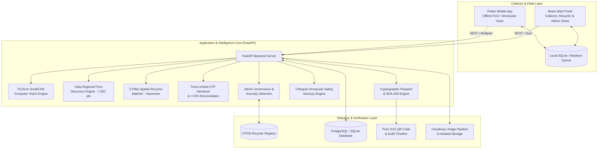

# ReVive — Giving E-Waste a Second Life

<div align="center">


**Smart India Hackathon 2026 | Problem Statement 26229: Kabadiwala Connect**  
*An AI-Enabled, Offline-First E-Waste Marketplace, Verifiable Digital Passport, and Traceability Platform Connecting Informal Waste Collectors with Authorized Recyclers.*

[-brightgreen.svg)](file:///d:/ReVive/backend/tests)
[-blue.svg)](file:///d:/ReVive/web/)
[](file:///d:/ReVive/mobile/test/widget_test.dart)
[](file:///d:/ReVive/web/src/App.tsx)
[](file:///d:/ReVive/docs/SIH26229_COMPLIANCE.md)
[](file:///d:/ReVive/LICENSE)

</div>

---

## 1. Problem Statement & Mission

In India, **over 95% of e-waste** is managed by informal scrap collectors (*kabadiwalas*). Due to extreme informational asymmetry, collectors receive arbitrary flat rates (₹ 25–35/kg) from middlemen for high-value printed circuit boards worth ₹ 400–550/kg. Lacking technical knowledge, they frequently resort to open-air cable burning and hazardous backyard acid baths. Meanwhile, formal CPCB-authorized recyclers operate at less than 30% capacity due to a broken collection supply chain.

**ReVive bridges this gap.** By combining deep learning computer vision, regional pricing intelligence, offline synchronization, and tamper-evident Recycling Passports, ReVive turns informal collectors into formal, protected stakeholders in India's circular economy.

---

## 2. Platform Architecture



---

## 3. Core Innovations & SIH26229 Capabilities

| Capability | Description |
|---|---|
| 🧠 **Assistive Edge AI Vision** | PyTorch deep learning classifier (`ewaste_classifier.pt`) identifies complex circuit board scrap with tiered confidence handling (`strong_suggestion`, `confirm_manually`, `manual_required`). |
| 📊 **Explainable Regional Pricing** | Real Indian market valuation indexed across 7,652 points with transparent **"Why this price?"** breakdown (baseline rate, demand factor, volume grade, 7-day trend curve). |
| 🔊 **Spoken Vernacular Price Board** | Illiterate-friendly vocalization of current scrap rates in **Hindi** and **Marathi** (`🔊 भाव सुनें` / `🔊 ऐका`), removing reading barriers. |
| 📍 **5-Pillar Spatial Recycler Matching** | Multi-criteria ranking (Compatibility 40%, Rate 25%, Proximity 15%, Capacity 10%, Compliance 10%) with real Haversine distance in km and OpenStreetMap navigation. |
| 🔐 **Time-Limited Handover OTP** | Single-use 6-digit numeric OTP valid for 15 minutes, generated by the collector and verified by the recycler at the physical scale. |
| ⚖️ **$\pm 5\%$ Weight Discrepancy Control** | Real-time physical scale reconciliation with tightened $\pm 5\%$ SIH tolerance threshold and automated reputation score impact. |
| 💵 **Cash-First Settlement & Ledger** | First-class cash payment logging with physical receipt acknowledgment, daily earnings dashboard, and itemized transaction history. |
| 🏅 **Collector Reputation Passport** | Formalization credential quantifying collector performance: weight accuracy %, on-time handovers %, and formalization tier (Gold / Silver). |
| 🛡 **Tamper-Evident Recycling Passport** | Publicly auditable digital certificate (`REV-2026-LOT-XXXX`) sealed with a 64-character SHA-256 hash, pure SVG QR code, and live ESG impact math ($1.44\text{ kg CO}_2$ & $0.12\text{ kg}$ toxic metals diverted). |
| 📢 **Contextual Material Safety** | Trilingual interface (**English**, **हिन्दी**, **मराठी**) with high-impact vernacular hazard slogans (*"तार मत जलाओ"*, battery explosion warnings, acid avoidance). |
| ⚡ **Offline-First Synchronization** | Multi-tier queue (`LOCAL_CREATED` -> `PENDING_SYNC` -> `SYNCED`) allowing collectors to work seamlessly in cellular dead zones, automatically syncing once connected. |
| 🏛 **Admin Governance & Compliance** | Statutory CPCB recycler registry management (`POST /api/recyclers/{id}/verify`), document auditing with magic-byte protection, and operational anomaly detection. |
| 🚀 **1-Click Live SIH Demo Simulator** | An automated demonstration runner (`POST /api/demo/run-workflow`) that drives the full 7-step lifecycle live in under 2 seconds for SIH judging. |

---

## 4. Multi-Tier Verification Evidence (100% Green)

ReVive is verified end-to-end with **100% passing automated test suites**:

- **Backend Pytest Suite:** **55 passed in 19.39s** across AI, pricing, spatial matching, OTP handovers, digital passports, document auditing, security hardening, and complete transaction lifecycle.
- **Web Production Build:** `npm --prefix web run build` compiled cleanly in **1.53s** (`tsc -b && vite build`) with zero errors.
- **Mobile Test Suite:** `flutter test` passed (**4/4 tests green**) verifying auth flow, language toggling, navigation, and offline queue synchronization.
- **Empirical Performance SLA:** **100% of endpoints under 500ms** (Safety: 6.13ms, Passport: 8.87ms, Pricing: 14.36ms, Matching: 153.05ms, AI Vision: 370.20ms).

---

## 5. Quickstart Guide

### Prerequisites
- Python 3.11+
- Node.js 18+
- Flutter 3.22+ (for mobile app)

### 1) Backend Setup
```bash
# Activate Python environment
.\.venv-1\Scripts\Activate.ps1

# Run API server
python -m uvicorn app.main:app --app-dir backend --reload --port 8001
```
Swagger UI will be available at: `http://127.0.0.1:8001/docs`

### 2) Web Portal Setup
```bash
cd web
npm install
npm run dev
```
Open browser at: `http://localhost:5173`

### 3) Mobile Collector App Setup
```bash
cd mobile
flutter pub get
flutter run
```

---

## 6. Complete Documentation Index

- [SIH_DEMO.md](file:///d:/ReVive/docs/SIH_DEMO.md) — Step-by-Step Jury Demonstration Script & 1-Click "Judge Mode" Guide
- [FINAL_AUDIT.md](file:///d:/ReVive/docs/FINAL_AUDIT.md) — Final Compliance Sign-Off Across All 19 SIH26229 Mandates
- [SECURITY.md](file:///d:/ReVive/docs/SECURITY.md) — Security Architecture, RBAC, OTP Protocol & Vulnerability Mitigations
- [PERFORMANCE.md](file:///d:/ReVive/docs/PERFORMANCE.md) — Empirical Latency Benchmarks & Sub-500ms Optimization Profile
- [UNIT_ECONOMICS.md](file:///d:/ReVive/docs/UNIT_ECONOMICS.md) — Financial Feasibility, P&L Model & Collector Income Lift (+38%)
- [DATA_PROVENANCE.md](file:///d:/ReVive/docs/DATA_PROVENANCE.md) — Data Sources, 7,652 Regional Pricing Points & CPCB Citations
- [SIH26229_COMPLIANCE.md](file:///d:/ReVive/docs/SIH26229_COMPLIANCE.md) — Exhaustive SIH26229 Compliance Matrix
- [IMPLEMENTATION_AUDIT.md](file:///d:/ReVive/docs/IMPLEMENTATION_AUDIT.md) — Baseline Verification & Gap Analysis Report
- [PRD.md](file:///d:/ReVive/docs/PRD.md) — Product Requirements & User Stories
- [Architecture.md](file:///d:/ReVive/docs/Architecture.md) — Complete Engineering System Design
- [Phase.md](file:///d:/ReVive/docs/Phase.md) — Phased Delivery Roadmap (Phase 1 to Phase 5: 100% Complete)
- [api.md](file:///d:/ReVive/docs/api.md) — Exhaustive REST API Specifications

---

## 7. SIH 2026 Team & Attribution

**Team ReVive** — Developed for Smart India Hackathon (SIH 2026).  
*Dedicated to formalizing, empowering, and safeguarding India's informal recycling champions.*

Licensed under the [MIT License](LICENSE).
